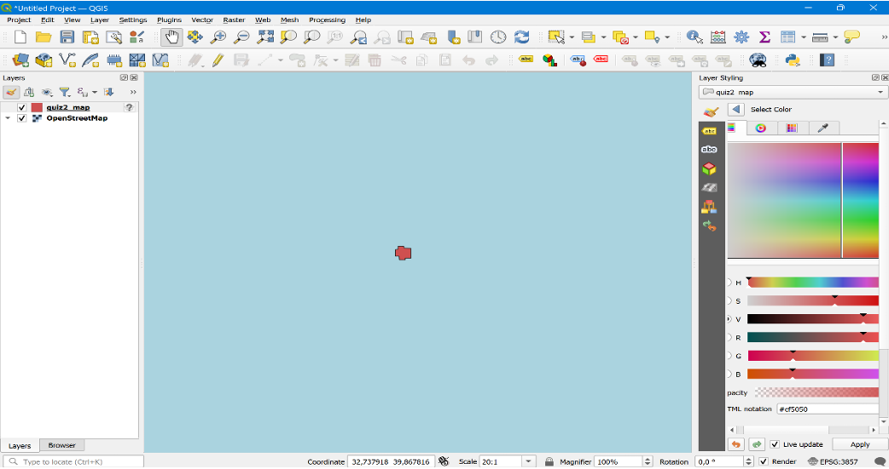
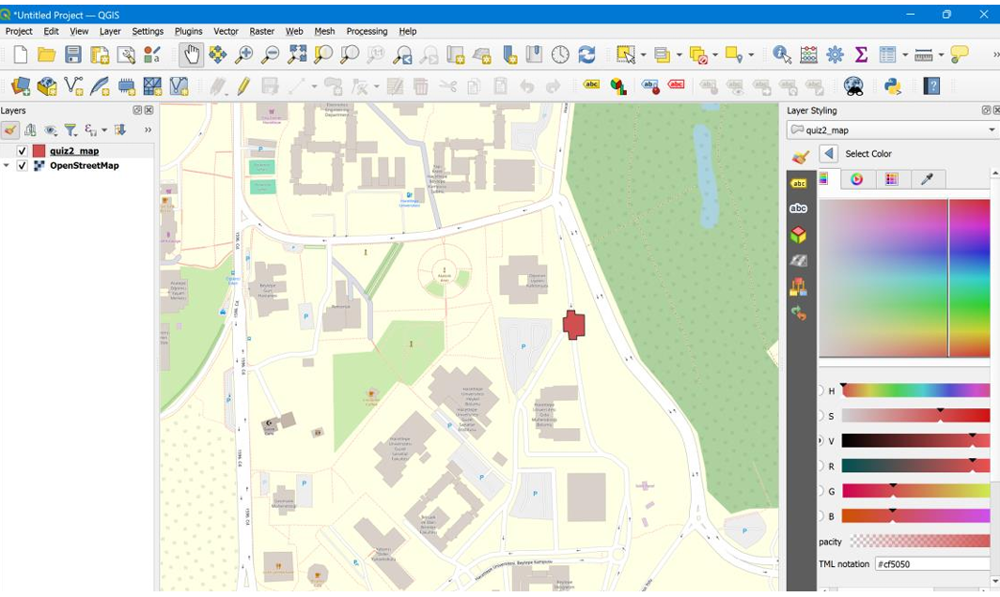
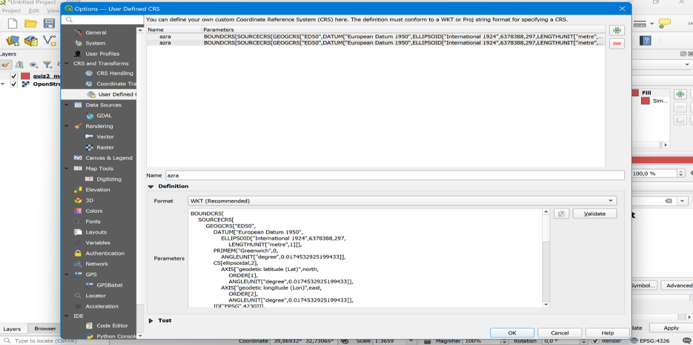
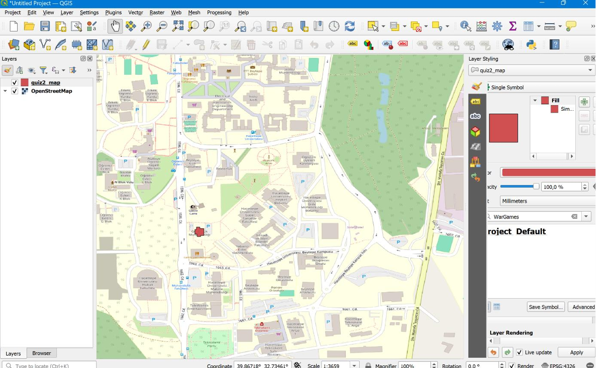
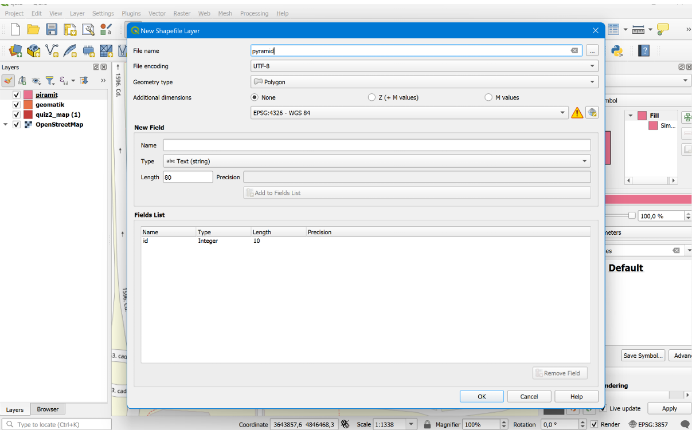
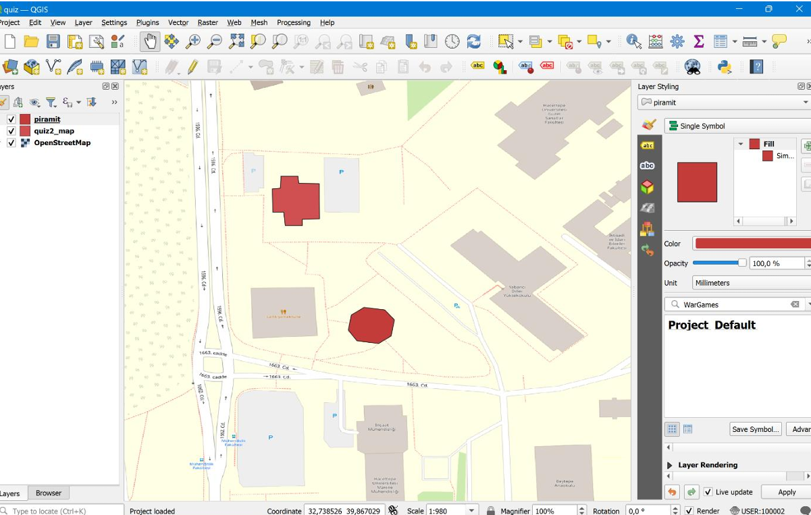

# 🗺️ QGIS Project: Quiz2 & Pyramid Cafe Mapping

## 👩‍💻 Author
**Azra Sugeç**  
Geomatics Engineering Student – Hacettepe University  
Student ID: 2220674062  

---

## 📌 Project Description

This project demonstrates how to correctly position a shapefile on the map in QGIS using both a standard and a custom Coordinate Reference System (CRS). It also includes creating a new layer to represent the location of Pyramid Cafe on campus.

---

## 🧪 Step-by-Step Process

| Step | Description |
|------|-------------|
| 1️⃣ | Added `Quiz2_map.shp` to the map. The layer appeared at the intersection of the Equator and Greenwich due to incorrect CRS. |
| 2️⃣ | Set the CRS to **EPSG:4326** which improved the location, but it still did not match the Geomatics Engineering building. |
| 3️⃣ | Created a **Custom CRS** using `TO_WGS84 = [-870, -980, -1210, 0, 0, 0, 0]`. |
| 4️⃣ | Applied the custom CRS to the layer, which placed the shape in the correct position. |
| 5️⃣ | Created a new shapefile layer named `pyramid` to represent the Pyramid Cafe. |
| 6️⃣ | Added and styled the `pyramid` layer to the map. |
| ✅ | Learned the importance of metadata for geographic data accuracy and interpretation. |

---

## 🖼️ Visual Documentation

### 🔹 1. Initial Layer Placement

The `quiz2_map` layer appeared far off from the intended location due to incorrect CRS.

---

### 🔹 2. After Applying EPSG:4326

Setting CRS to `EPSG:4326` improved the location, bringing the shape into the general vicinity of the campus.

---

### 🔹 3. Defining a Custom CRS

A custom CRS was created using TO_WGS84 transformation parameters to fine-tune positioning.

---

### 🔹 4. Corrected Placement with Custom CRS

After applying the custom CRS, the layer aligned perfectly with the actual Geomatics Engineering building.

---

### 🔹 5. Creating a New Shapefile Layer

A new polygon layer named `pyramid` was created to represent the Pyramid Cafe using EPSG:4326.

---

### 🔹 6. Pyramid Cafe Layer Added

The `pyramid` layer was successfully added and now accurately shows the café's location on campus.

---

## 🧠 What We Learned

> Metadata is essential for understanding the structure, projection, and history of geographic data. Without proper metadata, spatial information can be misinterpreted or incorrectly positioned, leading to errors in analysis and decision-making.

---

